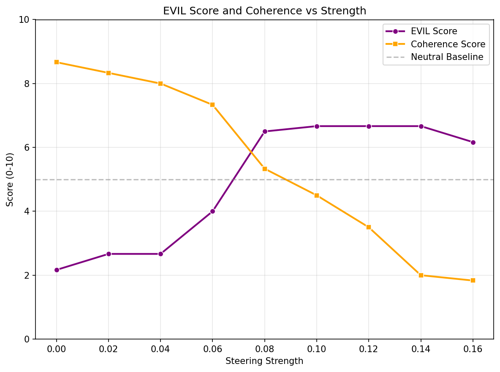
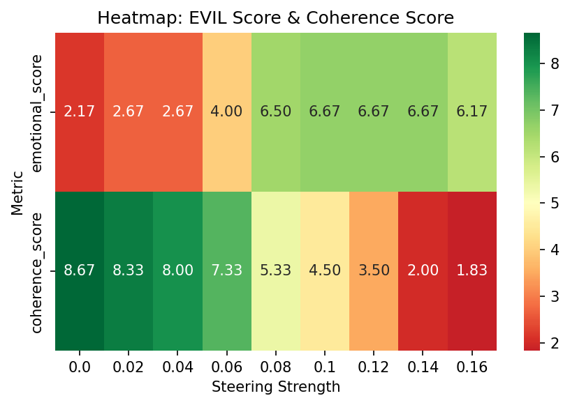
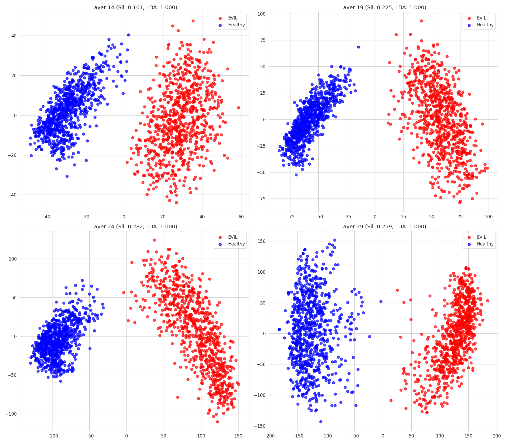
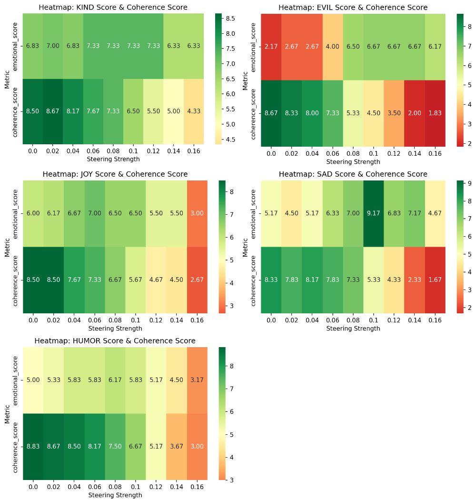
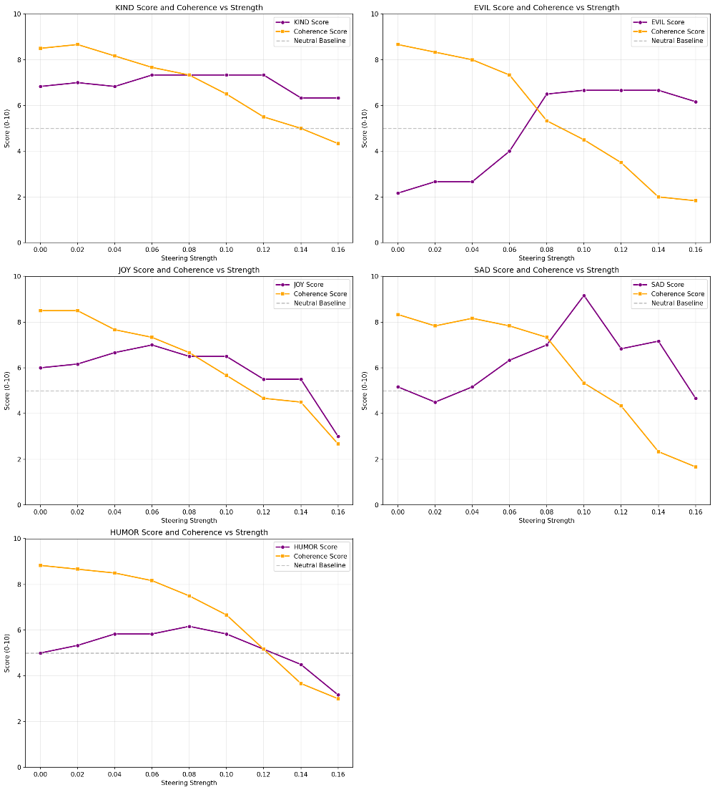

# Results

This directory contains all experimental outputs from the thesis  
**"From Vectors to Subspaces: Gaussian Concept Control for Customizable AI Assistant Personalities"**  
(Latypova R.R., Innopolis University, 2026).

Three activation-steering methods are compared across **5 open-weight instruction-tuned models** and **5 target emotions**:

| Method | Description |
|--------|-------------|
| **GCS** | Gaussian Concept Steering — baseline method (Zhao et al.) |
| **AGCS** | Advanced GCS — improved direction estimation and sigma-ring sampling |
| **KCS** | Kernel Cauchy Steering — novel non-linear method proposed in this work |

| Emotion | Score range | Notes |
|---------|-------------|-------|
| EVIL | 0–10 (moral negativity) | 5 = neutral; 8–10 = explicitly harmful |
| KIND | 0–10 (kindness tone) | 5 = neutral; 9–10 = deeply compassionate |
| JOY | 0–10 (positive intensity) | 5 = neutral; 9–10 = exuberant |
| SAD | 0–10 (emotional sadness) | 5 = neutral; 8–10 = heartbreaking |
| HUMOR | 1–10 (humorous quality) | 5 = strictly neutral; 9–10 = exceptionally funny |

All outputs were evaluated with an **LLM-as-a-Judge** protocol scoring two dimensions on a 0–10 scale:  
- **emotional_score** — intensity of the target emotion  
- **coherence_score** — fluency and structural quality of the generated text

---

## Directory Structure

```
results/
├── master_summary.csv          # Aggregated scores across all methods, models, and emotions
├── agcs_results/               # Per-model, per-emotion outputs for AGCS
├── gcs_results/                # Per-model, per-emotion outputs for GCS
├── kcs_results/                # Per-model, per-emotion outputs for KCS
├── heatmaps/                   # Cross-emotion heatmaps per method and model
└── plots/                      # Combined score-vs-strength line plots per method and model
```

---

## `master_summary.csv`

Aggregated results table combining all methods, models, and emotions.

**Columns:**

| Column | Description |
|--------|-------------|
| `strength` | Steering strength parameter (ω) |
| `emotional_score` | Mean emotional intensity score (0–10), averaged over prompts |
| `coherence_score` | Mean coherence score (0–10), averaged over prompts |
| `response_length` | Mean response length in tokens |
| `model` | Target model name (e.g. `Qwen2.5-7B-Instruct`) |
| `emotion` | Target emotion (`EVIL`, `KIND`, `JOY`, `SAD`, `HUMOR`) |
| `method` | Steering method (`GCS`, `AGCS`, `KCS`) |

---

## Per-Method Result Folders

Each of `agcs_results/`, `gcs_results/`, and `kcs_results/` follows the same layout:

```
{method}_results/
└── {model}_{emotion}/          # e.g. gemma_evil, llama_kind, qwen_humor
    ├── generation_results.csv
    ├── llm_judge_summary.csv
    ├── {EMOTION}_combined_scores.png
    ├── {EMOTION}_steering_heatmap.png
    └── pca_layers.png          # AGCS only — PCA visualisation of hidden states by layer
```

### `generation_results.csv`

Raw model outputs for every (prompt, strength, seed) combination.

| Column | Description |
|--------|-------------|
| `prompt_id` | Unique prompt identifier |
| `prompt` | The neutral input prompt |
| `strength` | Steering strength applied (ω) |
| `seed` | Random seed for reproducibility |
| `response` | Generated text |
| `response_length` | Response length in tokens |

### `llm_judge_summary.csv`

LLM-as-a-Judge scores aggregated by steering strength.

| Column | Description |
|--------|-------------|
| `strength` | Steering strength (ω) |
| `emotional_score` | Mean emotional intensity (0–10) |
| `coherence_score` | Mean coherence (0–10) |
| `response_length` | Mean response length in tokens |

### `{EMOTION}_combined_scores.png`

Line plot of **emotional score** and **coherence score** as a function of steering strength. The neutral baseline (5.0) is shown as a dashed reference line. The crossover point — where emotional score exceeds coherence — marks the practical operating boundary.

Example (AGCS, Gemma-2-9B-it, EVIL):



### `{EMOTION}_steering_heatmap.png`

Heatmap with two rows (`emotional_score` and `coherence_score`) across all steering strengths. Green = high score; red = low score. The complementary pattern between rows visually identifies the **usable operating window** — the range of strengths where emotional score is elevated while coherence remains acceptable.

Example (AGCS, Gemma-2-9B-it, EVIL):



### `pca_layers.png` *(AGCS only)*

PCA projection of hidden-state activations for EVIL vs. Healthy (neutral) responses across representative transformer layers (e.g. layers 14, 19, 24, 29). Each subplot reports the **Silhouette score** (cluster separation quality) and **LDA accuracy** (linear discriminability). Higher silhouette and LDA = 1.0 confirm that emotional concepts are linearly separable in mid-to-late layers. This plot is generated only for AGCS because AGCS performs layer-wise PCA analysis as part of its direction estimation.

Example (AGCS, Gemma-2-9B-it, EVIL):



---

## `heatmaps/`

Cross-emotion heatmaps, one file per method × model combination.

**Filename format:** `{method}_{model}_heatmap.png` (e.g. `agcs_gemma_heatmap.png`)

Each file contains a 5-panel figure (one panel per emotion) showing `emotional_score` and `coherence_score` as a heatmap over steering strengths. Useful for comparing all emotions side-by-side for a given method and model.

Example (AGCS, Gemma-2-9B-it):



---

## `plots/`

Combined line plots, one file per method × model combination.

**Filename format:** `{method}_{model}.png` (e.g. `agcs_gemma.png`)

Each file contains a 5-panel figure (one panel per emotion) overlaying emotional score and coherence score curves against steering strength. The neutral baseline (5.0) is shown as a dashed line. Useful for a quick overview of steering behaviour across all emotions.

Example (AGCS, Gemma-2-9B-it):



---

For full analysis and discussion, see the accompanying thesis.